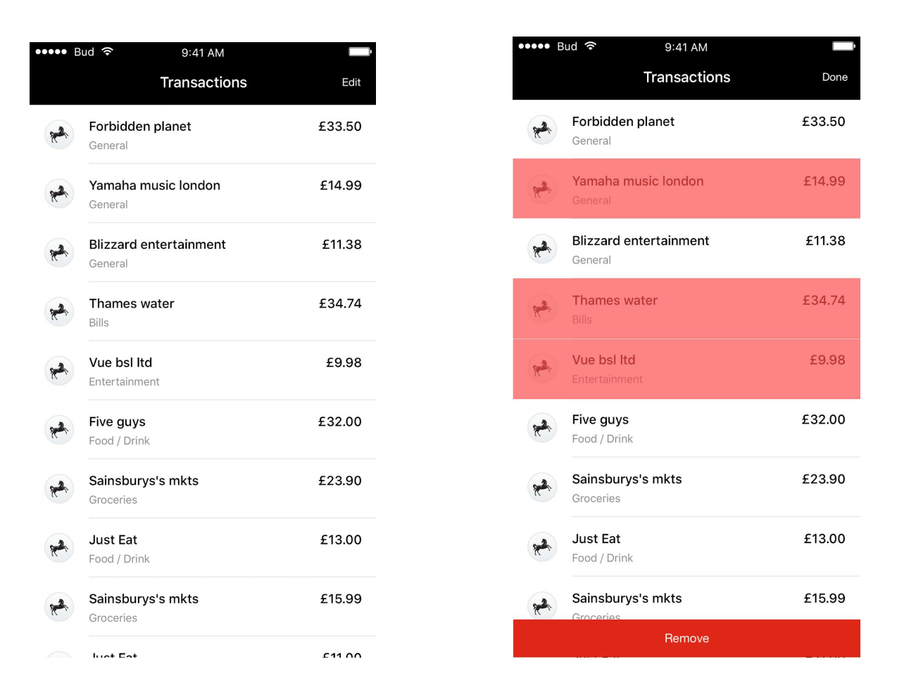
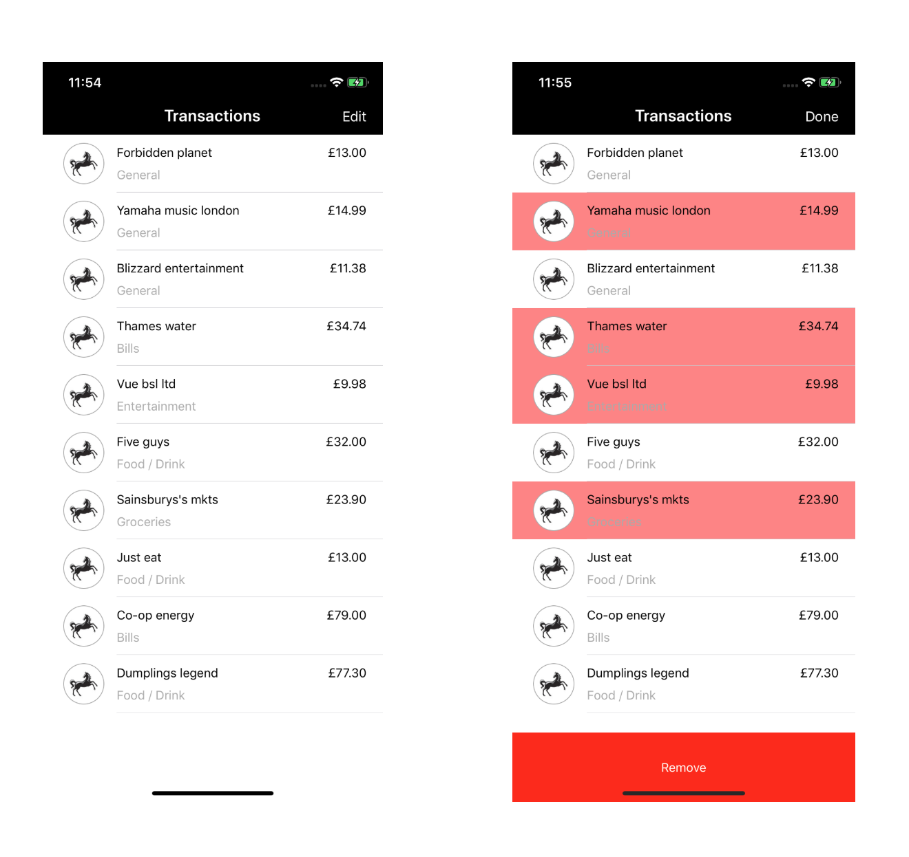

# SwiftTechnicalTest
Bud’s iOS Technical Test.

#### Task:

1. Retrieve Transactions from endpoint: http://www.mocky.io/v2/5b36325b340000f60cf88903
2. Display them according to provided design.
3. Implement Edit functionality, where the user can select multiple cells (as in design) and tap the Remove
button to remove the selected cells.

Note: Please, contact us if the endpoint doesn’t work.

#### Design:

#### Result:

